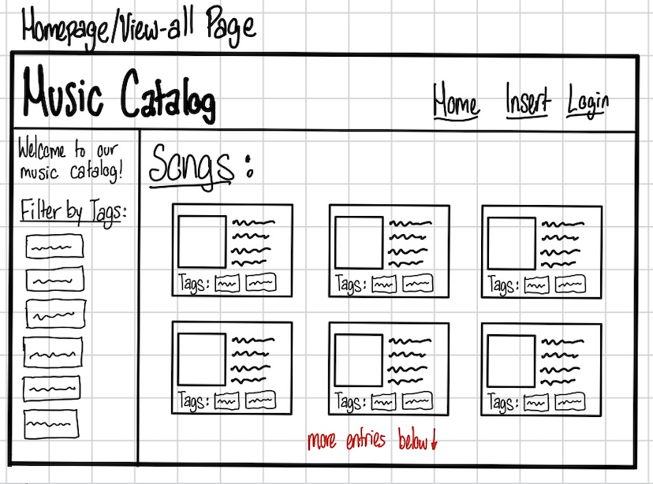
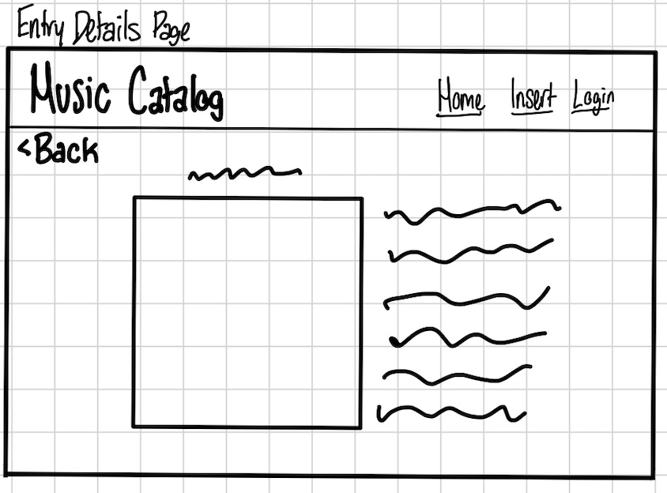
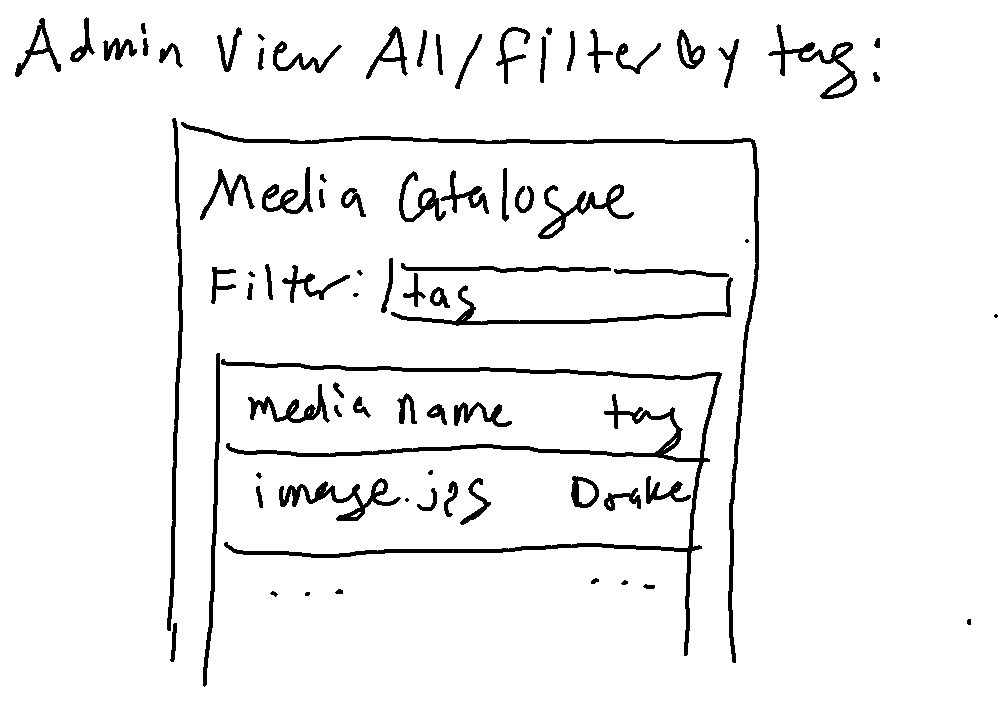
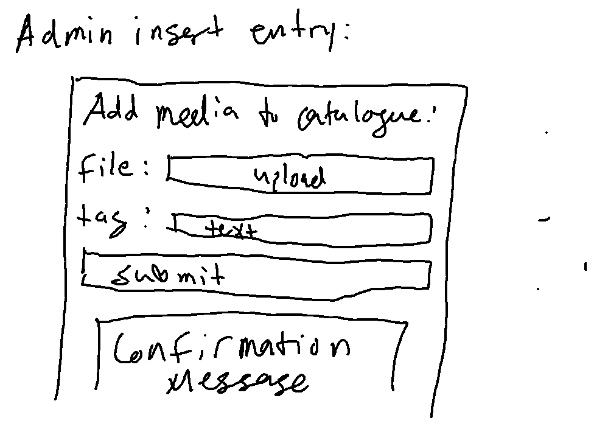
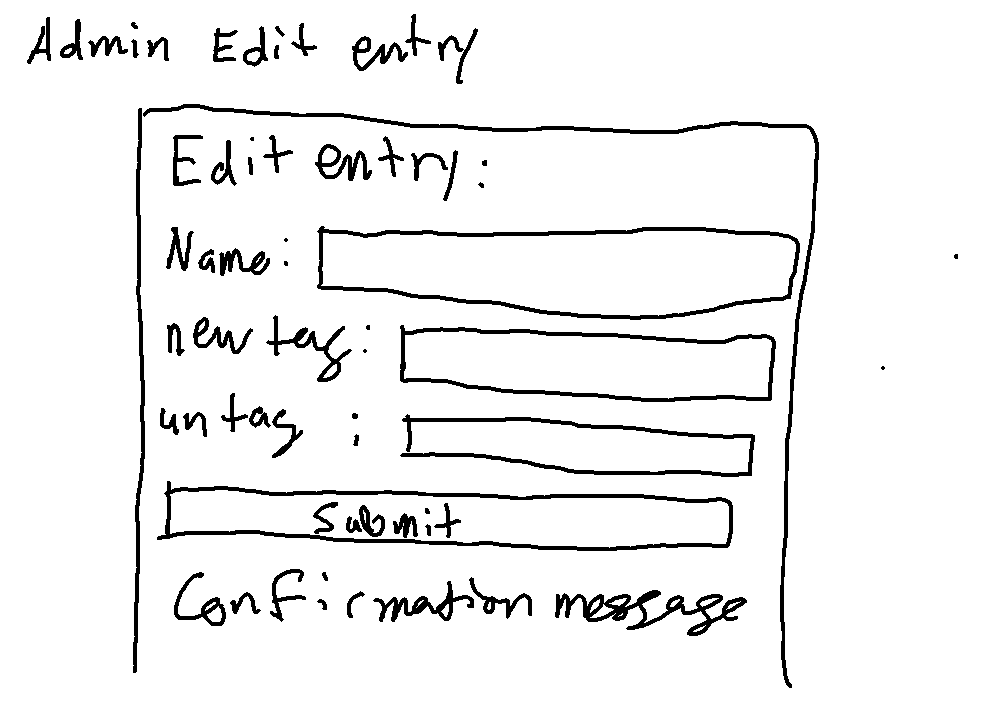
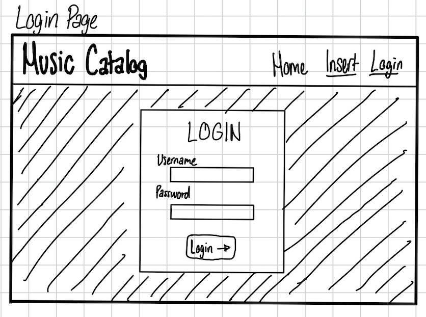

# Project 3, Milestone 1: **Team** Design Journey

[← Table of Contents](design-journey.md)

**Make the case for your decisions using concepts from class, as well as other design principles, theories, examples, and cases from outside of class (includes the design prerequisite for this course).**

You can use bullet points and lists, or full paragraphs, or a combo, whichever is appropriate. The writing should be solid draft quality.

## Catalog
> What will your catalog website be about? (1 sentence)

This will be a music catalog website displaying different songs.

## Narrow or Wide Screen
> How will your **consumer** user access this website? From a narrow or wide screen?

Wide screen

## Catalog Design
> Sketch each page of your entire media catalog website
> Provide a brief explanation _underneath_ each sketch. (1 sentence per sketch)
> **Refer to consumer or administrator persona by name in each explanation.**

**home / consumer view all / filter by tag:**

Jamie can see all of the songs with their pictures and information in a grid/card layout on this page.

**consumer entry details:**

After clicking on one of the songs, Jamie can see a more expanded view of the selected song to see all of its information.

**admin view all / filter by tag:**

This page allows Tony to easily browse the media catalogue and filter entries by tag.

**admin insert entry:**

On this page, Tony can add to the media catalogue and will recieve a confirmation message when he does so.

**admin edit entry / tag / untag:**

This page allows Tony to add and remove tags from a post with a given name.

**login:**

Since Jamie is not an admin user, Tony can login here to access admin view of the site.

## Catalog Design Patterns
> Explain how your design employs common catalog design patterns. (1-2 sentences)

Our design employs common catalog patters because it draws form examples seen in class/lab. Our catalogue is also very simple so users can easily navigate it.

## URL Design
> Plan your HTTP routing.
> List each route and the PHP file for each route.

| Page                                     | Route          | PHP File                |
| ---------------------------------------- | -------------- | ----------------------- |
| home / consumer view all / filter by tag | /              | pages/home.php          |
| consumer entry details                   | /entry-details | pages/entry.php         |
| admin view all / filter by tag           | /admin-viewall | pages/admin-viewall.php |
| admin insert entry                       | /admin-insert  | pages/admin-insert.php  |
| admin edit entry / tag / untag           | /admin-edit    | pages/admin-edit.php    |
| login                                    | /login         | pages/login.php         |

> Explain why these routes (URLs) are usable for your persona. (1 sentence)

These URLs are usable for Jamie and Tony because they are short and to the point, signifying what the page is about without taking up too much space.

## Database Schema
> Plan the structure of your database. You may use words or a picture.
> A bulleted list is probably the simplest way to do this.
> Include constraints for each field.

**Table:** music

- id: NUMERIC {PRIMARY KEY, AUTO INCREMENT, NOT NULL, UNIQUE}
- music_name: TEXT {NOT NULL}
- media: TEXT {NOT NULL}
- tag_id: NUMERIC {FOREIGN KEY}

**Table:** tags

- id: NUMERIC {PRIMARY KEY, AUTO INCREMENT, NOT NULL, UNIQUE}
- tag_name: TEXT {NOT NULL, UNIQUE}

**Table:** music_tags

- id: NUMERIC {PRIMARY KEY, AUTO INCREMENT, NOT NULL, UNIQUE}
- music_id: NUMERIC {FOREIGN KEY, NOT NULL}
- tag_id: NUMERIC {FOREIGN KEY, NOT NULL}

## Contributors

I affirm that I have contributed to the team requirements for this milestone.

Consumer Lead: Abolaji Awoyomi

Admin Lead: Richard Berlinghof

[← Table of Contents](design-journey.md)
